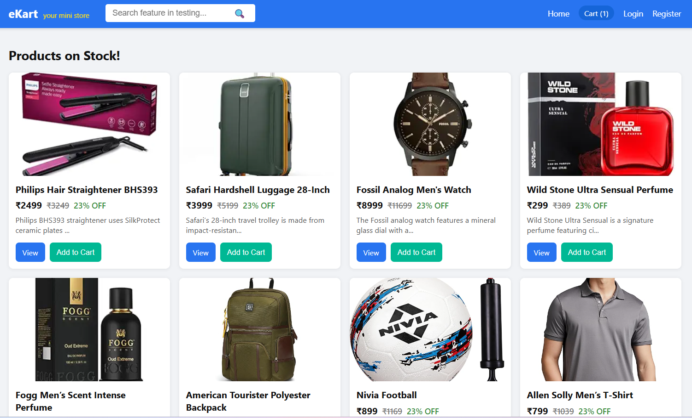
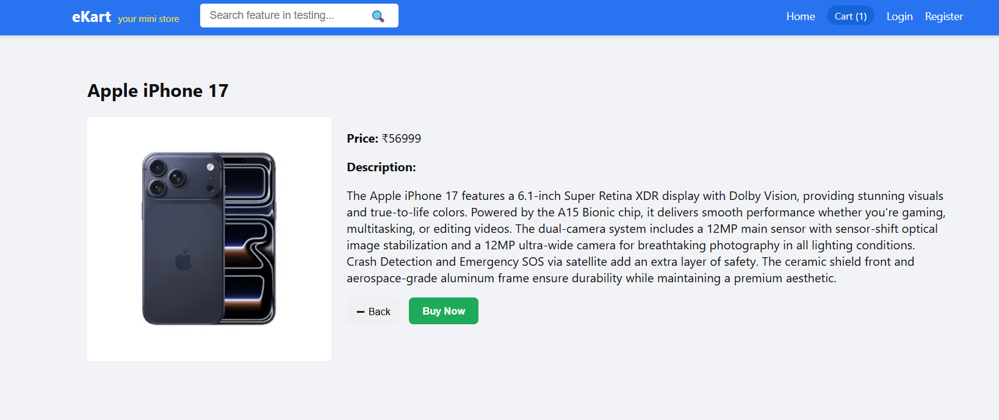
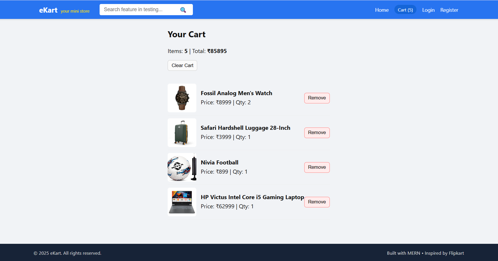
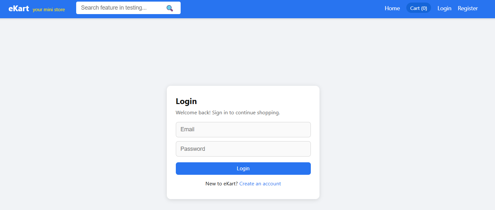
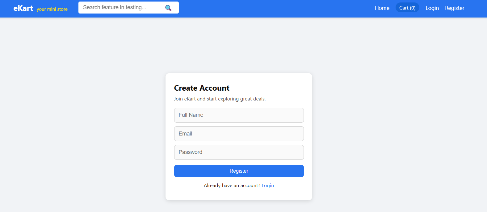

# eKart – MERN E-Commerce Web App 

A full-stack e-commerce web application built using the **MERN stack** (MongoDB, Express, React, Node.js) .

The app includes:
- User **authentication** (Register / Login with JWT)
- **Products listing** from MongoDB Atlas
- **Product detail** page with full description
- **Cart** with item count and total price
- **Responsive** Flipkart-inspired UI
- Ready structure for future **payment integration** and advanced features

---

## 📸 Screenshots

- **Home Page – Product Grid**  
  

- **Product Detail Page – View Product**  
  

- **Cart Page – Items & Total**  
  

- **Login Screen**  
  

- **Register Screen**  
  


## 🌐 Live Demo

- *It's live on **: `https://projecom.vercel.app/`
---

## 🧩 Features (What this app can do)

### 👤 Authentication (JWT-based)
- User **Register** (name, email, password)
- User **Login**
- Backend returns a **JWT token**
- Frontend stores `{ token, user }` in `localStorage`
- Protected endpoint: `/api/users/current` returns current logged-in user

### 🛍 Products
- Products stored in **MongoDB Atlas**:
  - `name`
  - `price`
  - `description` (detailed)
  - `imageUrl`
- Backend endpoints:
  - `GET /api/products` – Get all products
  - `GET /api/products/:id` – Get one product by ID

### 🛒 Cart
- Add to Cart from:
  - Home (product card)
  - Product detail page
- Cart stored in **React Context + localStorage**
- Features:
  - Cart item count in **Header**
  - Cart page with:
    - image, name, quantity, per item price
    - total items
    - total amount
  - Remove individual items
  - Clear cart button

### 💄 UI / UX
- Flipkart-inspired design:
  - Blue sticky navigation bar
  - Responsive product **grid** layout
  - Product card with:
    - image
    - name
    - price + striked MRP + `% OFF`
    - small description
    - buttons: **View** & **Add to Cart**
- Product detail page:
  - Large product image
  - Price box
  - Badges like `Best Seller`, `Fast Delivery`
  - Full description + highlights list
  - Buttons: **Back** and **Buy Now**  
    - `Buy Now` currently shows: _“This feature will be available soon!”_

### 📱 Responsive
- Desktop:
  - Multi-column product grid
  - Header with logo, cart, login/register/user
- Mobile:
  - Collapsible navbar (hamburger menu)
  - 1-column product list
  - Auth forms & cards responsive

---

## 🛠️ Tech Stack

**Frontend**
- React (Vite)
- React Router DOM
- Axios
- Context API (AuthContext & CartContext)
- Plain CSS + custom responsive layout

**Backend**
- Node.js
- Express.js
- MongoDB with Mongoose
- JWT for authentication
- bcryptjs for password hashing
- dotenv for environment variables
- cors for cross-origin requests

**Database**
- MongoDB Atlas (cloud)

---

## 🏗️ Project Structure

```bash
proj_ecom/
├── backend/
│   ├── src/
│   │   ├── config/
│   │   │   └── db.js
│   │   ├── controllers/
│   │   │   ├── authController.js
│   │   │   └── productController.js
│   │   ├── middlewares/
│   │   │   └── authMiddleware.js
│   │   ├── models/
│   │   │   ├── User.js
│   │   │   └── Product.js
│   │   ├── routes/
│   │   │   ├── authRoutes.js
│   │   │   └── productRoutes.js
│   │   ├── utils/
│   │   │   ├── generateToken.js
│   │   │   └── seedProducts.js
│   │   ├── app.js
│   │   └── server.js
│   ├── .env
│   └── package.json
│
└── frontend/
    ├── src/
    │   ├── api/
    │   │   └── api.js
    │   ├── components/
    │   │   ├── Header.jsx
    │   │   ├── Footer.jsx
    │   │   └── ProductCard.jsx
    │   ├── contexts/
    │   │   ├── AuthContext.jsx
    │   │   └── CartContext.jsx
    │   ├── pages/
    │   │   ├── Home.jsx
    │   │   ├── ProductPage.jsx
    │   │   ├── Login.jsx
    │   │   └── Register.jsx
    │   ├── assets/
    │   │   └── (screenshots & static images)
    │   ├── App.jsx
    │   ├── main.jsx
    │   └── styles.css
    ├── .env
    └── package.json

```
🧭 Future Enhancements

Product categories & filters
Search bar to filter products by name / brand
Ratings & reviews
Wishlist❤️
Address management & order history
Full checkout + payment integration (Razorpay / Stripe)
Admin panel:
Add/edit/delete products
View orders & users

💬 Project Summary 
“Built a full-stack e-commerce web application using the MERN stack as part of a MERN Full Stack internship evaluation. Implemented JWT-based user authentication, product listing from MongoDB Atlas, product detail pages, and a cart system using React Context and localStorage. Focused on clean architecture, reusable components, and a responsive Flipkart-inspired UI ready for future payment gateway integration.”

👨‍💻 Author
Name: Prasad H G
Role: MERN Full Stack 
Tech interests: MERN, JavaScript, React, Node.js, AI/ML in future.